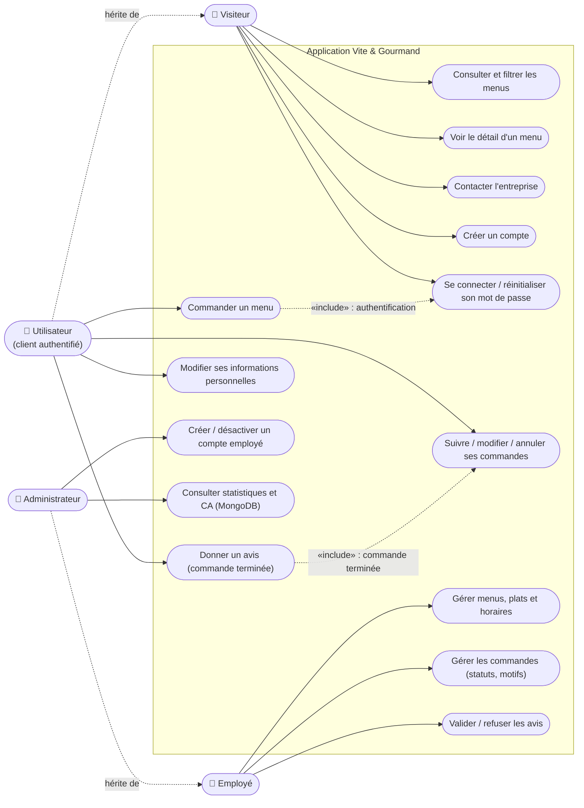
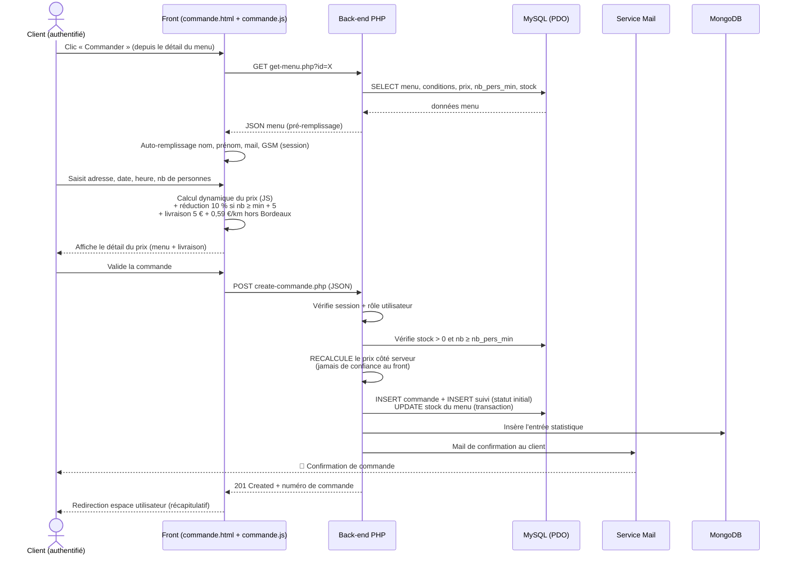
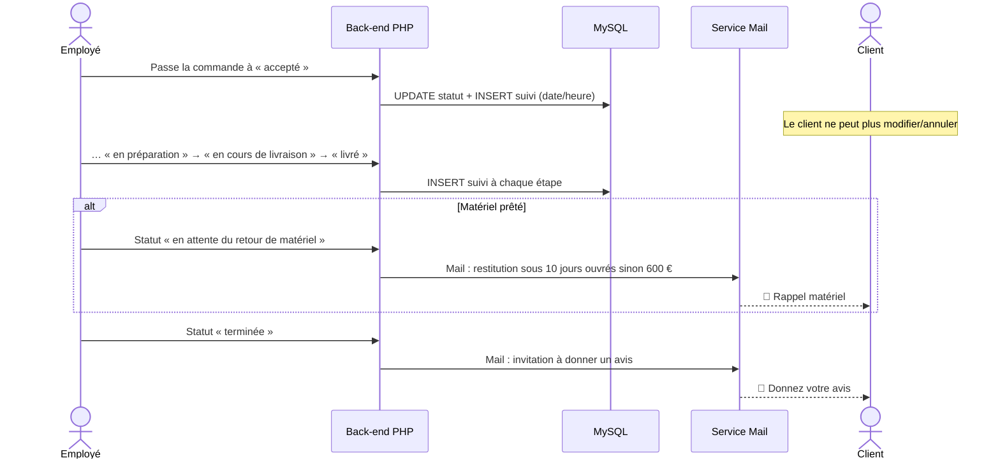
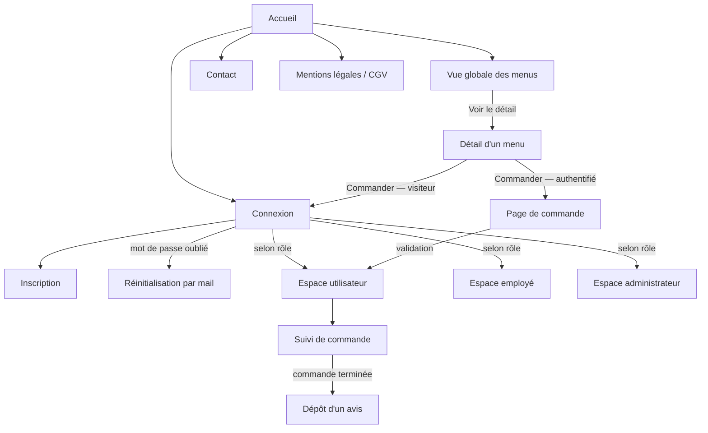

# 📐 Diagrammes UML — Vite & Gourmand

> Diagrammes en Mermaid (rendus nativement par GitHub). Pour le dossier projet, ils seront exportés en image (clic droit → export, ou [mermaid.live](https://mermaid.live)).

## 1. Diagramme de cas d'utilisation

> Mermaid n'a pas de type « use case » natif : représentation en graphe acteurs → cas d'utilisation, avec héritage entre acteurs (l'Utilisateur peut tout ce que fait le Visiteur, l'Administrateur tout ce que fait l'Employé).

## 2. Diagramme de séquence — Commander un menu

> Parcours le plus représentatif du projet (côté front **et** back) : calcul de prix dynamique, règles métier, mail automatique.

## 3. Diagramme de séquence — Cycle de vie côté employé (complément)

## 4. Schéma d'enchaînement des écrans

