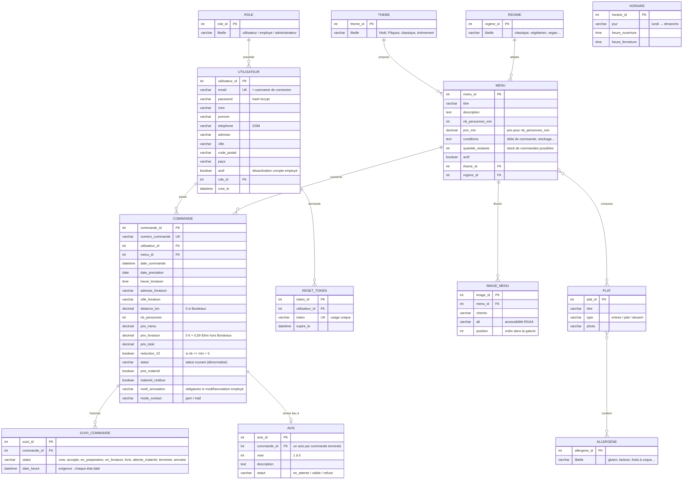

# 🗃️ Modèle Conceptuel de Données — Vite & Gourmand

> Basé sur l'annexe 1 de l'ECF, **corrigé et complété** : ajout du suivi historisé des commandes (exigence « tous les états avec date et heure »), de la galerie d'images, du type de plat et des tokens de réinitialisation de mot de passe.
> Le diagramme est en [Mermaid](https://mermaid.js.org/) : il s'affiche nativement sur GitHub.

## Diagramme entité-association



## Choix de conception (à justifier devant le jury)

| Choix | Justification |
|---|---|
| `SUIVI_COMMANDE` séparée de `COMMANDE` | Le cahier des charges exige l'historique de **tous** les états avec date et heure. Le statut courant est aussi dénormalisé dans `COMMANDE` pour simplifier les filtres employé. |
| `MENU`–`PLAT` en N-N (table `menu_plat`) | « Une entrée ou un plat / dessert peuvent être présents dans plusieurs menus ». |
| `PLAT`–`ALLERGENE` en N-N (table `plat_allergene`) | Un plat a plusieurs allergènes, un allergène concerne plusieurs plats. |
| `AVIS` lié à `COMMANDE` (pas directement à l'utilisateur) | L'avis se donne « depuis la commande » terminée → garantit 1 avis max par commande et un avis authentique. |
| `IMAGE_MENU` avec `alt` et `position` | Galerie ordonnée + exigence RGAA. |
| `actif` sur `UTILISATEUR` | Désactivation d'un compte employé sans suppression (traçabilité des commandes traitées, RGPD compatible). |
| `RESET_TOKEN` avec expiration | Réinitialisation de mot de passe sécurisée (token à usage unique). |

## Base NoSQL (MongoDB) — statistiques

Collection `stats_commandes` alimentée à chaque changement de statut de commande :

```json
{
  "menu_id": 1,
  "titre_menu": "Menu Noël Prestige",
  "date_commande": "2026-07-03T14:30:00Z",
  "nb_personnes": 10,
  "prix_total": 288.0,
  "statut": "terminee"
}
```

Elle alimente l'espace administrateur : **nombre de commandes par menu** (graphique comparatif) et **chiffre d'affaires par menu** avec filtres par menu et par période.
